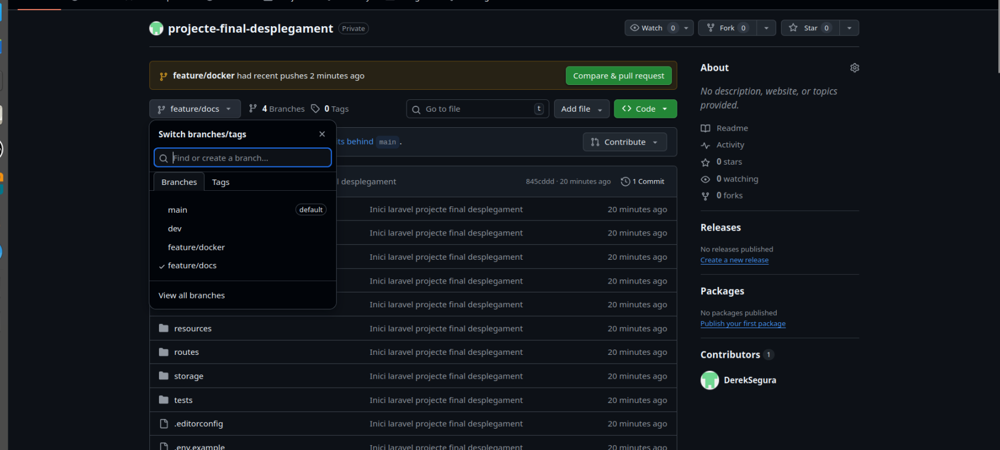
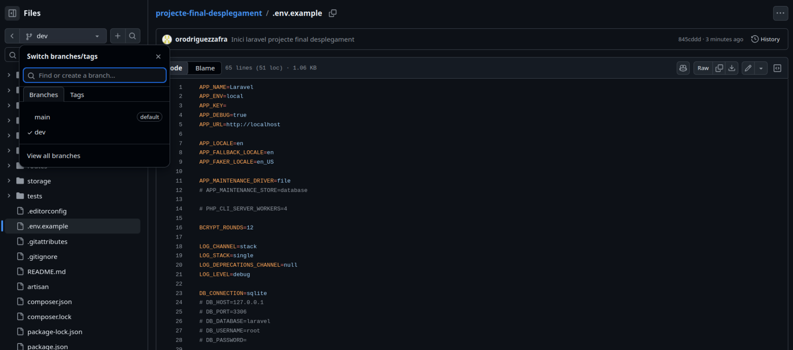
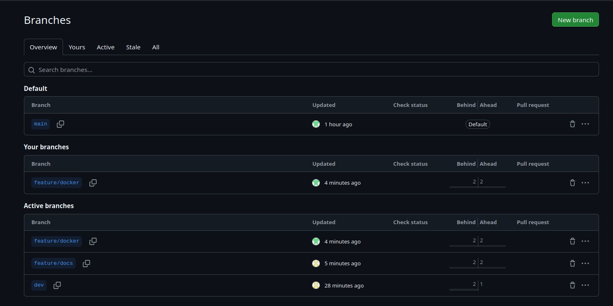
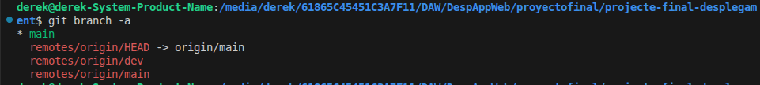
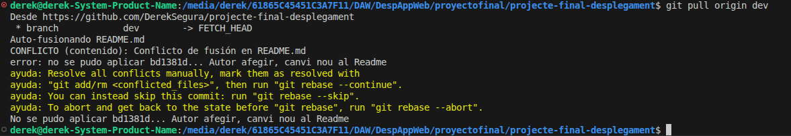
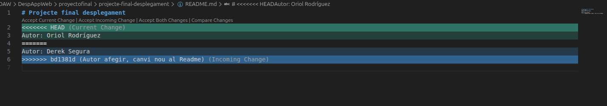
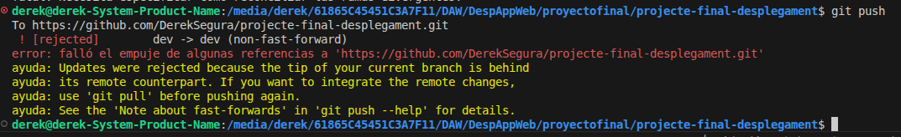
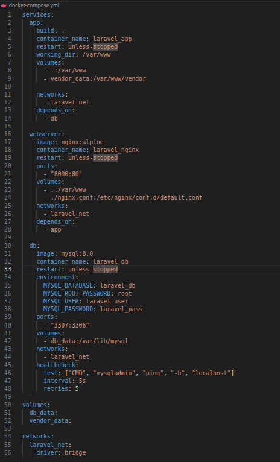
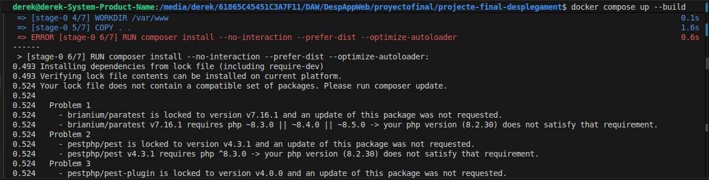
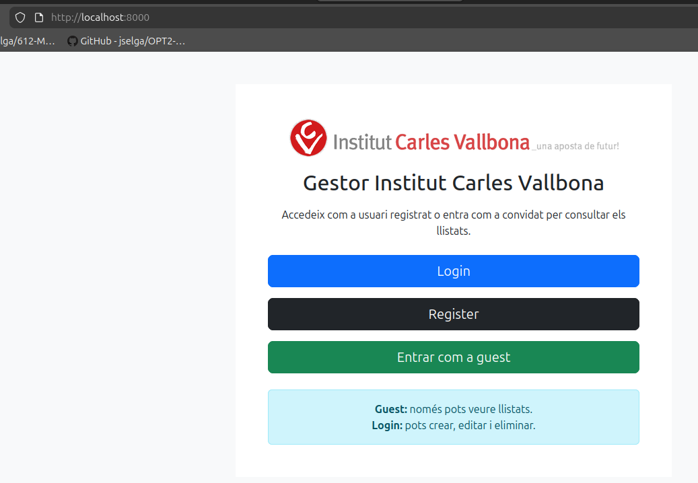

# REPORT – Projecte de Síntesi

## 1. Dades generals

**Nom del projecte:**  
Projecte de desplegament aplicació web

**Integrants:**  
Oriol Rodriguez  
Derek Segura

**Tecnologia principal (Laravel / React / Fullstack):**  
Laravel

**Enllaç al repositori:**  
https://github.com/DerekSegura/projecte-final-desplegament

**Data d’entrega:**  
15/3/26

---

## 2. Estat inicial del projecte

El projecte inicial consistia en una aplicació funcional però sense estructura professional clara.

**Estructura inicial del repositori:**
- Fitxers barrejats sense una organització clara
- Absència de separació entre entorn i codi

**Problemes detectats:**
- Configuració manual
- Dependències no documentades
- Execució no reproduïble

**Existència o no de .gitignore:**
- No existia `.gitignore` adequat

**Existència o no de Docker:**
- No hi havia Docker configurat

**Problemes de configuració o dependències:**
- Errors en instal·lació de dependències
- Variables d’entorn hardcodejades

**Captura i descripció de com és:**


Repositori de GitHub mostrant l'estructura inicial del projecte amb les branques main, dev, feature/docker i feature/docs, tots amb el missatge de commit inicial "Inici laravel projecte final desplegament".


Repositori de GitHub mostrant l'estructura inicial del projecte amb les branques main, dev, feature/docker i feature/docs, tots amb el missatge de commit inicial "Inici laravel projecte final desplegament".

**Reflexió breu:**

Faltava control de versions adequat, contenització, separació de configuració i documentació. No era un projecte reproduïble ni escalable.

---

## 3. Workflow Git aplicat

**Model de branques utilitzat:**
- `main` → producció
- `develop` → integració
- `feature/*` → funcionalitats

**Convencions de noms:**
- `feature/docker-setup`
- `feature/git-workflow`
- `fix/conflicts`

**Estratègia de merge utilitzada:**
- Merge amb commits (no fast-forward)

**Ús (o no) de rebase:**
- No s’ha utilitzat per evitar complicacions

**Exemples de commits:**
- `feat: add docker configuration`
- `fix: resolve merge conflict in config file`
- `chore: add .gitignore`

**Captura i descripció de com és:**

Pàgina de Branches a GitHub mostrant les branques actives del projecte: main (default), feature/docker, feature/docs i dev, amb l'estat de cada una (Behind/Ahead).


Terminal amb la comanda git branch -a mostrant les branques locals i remotes del repositori: main, remotes/origin/HEAD, remotes/origin/dev i remotes/origin/main.

---

## 4. Conflicte 1 – Mateixa línia

### 4.1 Com s’ha provocat

Cada membre ha modificat la mateixa línia d’un fitxer de configuració.

### 4.2 Missatge d’error generat

```
CONFLICT (content): Merge conflict in config/app.php
Automatic merge failed; fix conflicts and then commit the result.
```

**Captura i descripció de com és:**

Terminal mostrant el resultat de git pull origin dev amb el missatge CONFLICTO (contenido): Conflicte de fusió en README.md, indicant que la fusió automàtica ha fallat i cal resoldre'l manualment.

### 4.3 Marcadors de conflicte

```
<<<<<<< HEAD
configuració A
=======
configuració B
>>>>>>> branch
```

**Captura i descripció de com és:**

VSCode mostrant el fitxer README.md amb els marcadors de conflicte de Git: <<<<<<< HEAD amb el canvi de l'Oriol Rodríguez (Current Change) i >>>>>>> bd1381d amb el canvi del Derek Segura (Incoming Change), separats pel delimitador =======.
### 4.4 Resolució aplicada

- S’ha escollit una combinació de les dues configuracions
- Es valida manualment el funcionament

### 4.5 Reflexió

Hem après a interpretar conflictes i a prendre decisions conscients sobre el codi.

---

## 5. Conflicte 2 – Dependències o estructura

### 5.1 Descripció del conflicte

Conflicte en fitxers de dependències (`composer.json`)

### 5.2 Error generat

Errors d’instal·lació de paquets incompatibles.

**Captura i descripció de com és:**

Terminal mostrant l'error [rejected] dev -> dev (non-fast-forward) en fer git push, indicant que la branca remota estava per davant de la local i calia fer git pull primer.

### 5.3 Resolució aplicada

- Unificació de versions
- Reinstal·lació de dependències

### 5.4 Diferències respecte al conflicte anterior

- Aquest conflicte afecta execució, no només codi
- Més complex de validar

---

## 6. Dockerització

### 6.1 Arquitectura final

Serveis definits:
- App (Laravel)
- Base de dades
- Servidor web

**Captura i descripció de com és:**

Fitxer docker-compose.yml amb els tres serveis definits: app (contenidor Laravel amb volums i xarxa laravel_net), webserver (Nginx:alpine exposant el port 8000:80) i db (MySQL 8.0 amb la base de dades projecteFinalLaravel, contrasenya usuari i volum persistent db_data).
### 6.2 Variables d’entorn

- DB_HOST
- DB_USER
- DB_PASSWORD

No es versiona `.env` per seguretat.

### 6.3 Persistència (si s'escau)

- Ús de volums per base de dades

### 6.4 Problemes trobats

- Errors de ports ocupats
- Problemes de build

**Captura i descripció de com és:**

Error durant el docker compose up --build en l'estadi [stage-0 6/7] RUN composer install. El build falla perquè el fitxer composer.lock conté paquets (brianium/paratest, pestphp/pest) que requereixen PHP ^8.3.0 però la versió del contenidor és 8.2.30.

---

## 7. Prova de desplegament des de zero

**Passos:**

1. Clonar repositori  
2. Executar:
```
docker compose up --build
```
3. Accedir a:
```
http://localhost:8000
```

**Ports utilitzats:**
- 8000 (app)
- 3306 (DB)

**Credencials de prova:**
- user: root
- password: usuari

**Captura i descripció de com és:**

Navegador accedint a http://localhost:8000 mostrant l'aplicació desplegada correctament: el Gestor Institut Carles Vallbona amb les opcions de Login, Register i Entrar com a guest.


## 8. Repartiment de tasques

- Derek Segura:
  - Configuració Git
  - Resolució de conflictes

- Oriol Rodriguez:
  - Dockerització
  - Documentació

---

## 9. Temps invertit

- Git: 6h  
- Docker: 6h  
- Documentació: 3h  

---

## 10. Reflexió final

**Quina ha estat la part més complexa?**  
La resolució de conflictes i configuració de Docker.

**Què faríeu diferent en un projecte real?**  
Planificació inicial millor i integració contínua.

**Heu entès realment com funcionen els conflictes i Docker?**  
Sí, especialment la importància de la reproduïbilitat i la gestió d’entorns.
